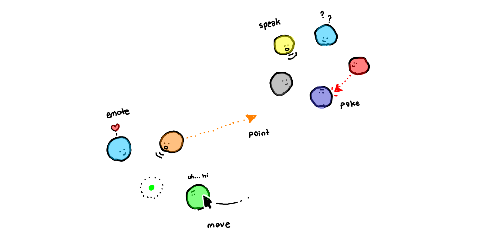

# Cozyroom

Space for social events, parties or virtual coffee shops. Using spatialized audio and interactions and hosted over WebRTC.



1. Start server
```
node signaling-server.js
```

2. Serve app
```
npm run serve
```